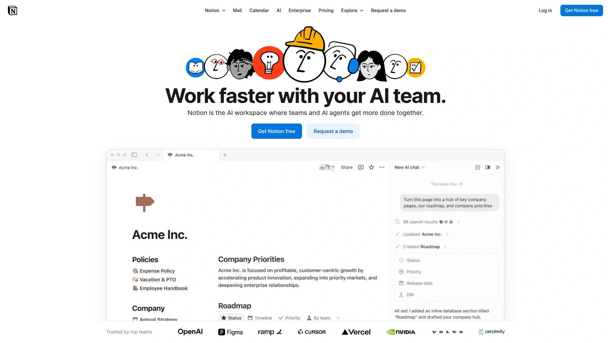

# 10 Best Employee Training Platforms in 2025

Running a business means you're constantly explaining the same things over and over. "How do we handle refunds again?" "What's the process for onboarding clients?" "Where's that policy document?" You've probably answered these questions a hundred times, and your team still gets confused. That's where employee training platforms come in—they turn your scattered knowledge into organized, searchable systems that actually work. Here's a breakdown of platforms that help you document processes, train your team faster, and stop reinventing the wheel every time someone has a question.

---

## **[Trainual](https://trainual.com)**

The go-to platform for turning your business chaos into organized playbooks that your team can actually follow.

Trainual makes it stupidly easy to document how your business actually runs. You write down your processes, policies, and training materials in one place, then assign them to your team. New hire? They get an onboarding path. Someone needs to learn a new role? You build them a custom training track. The interface feels like you're building a course, but without the learning management system complexity that makes you want to quit halfway through.

**What makes it work:**

The real power is in the structure. You organize everything into subjects (like "Sales Process" or "Customer Support"), then break those into topics. Each topic gets its own step-by-step training. Your team can search for anything, and managers can see who's completed what. It's built specifically for small to mid-sized businesses that need to scale without losing their minds trying to remember how everything works.

**Who should use it:**

Growing companies between 10-500 employees who are tired of explaining the same processes repeatedly. Works especially well if you're franchising, have remote teams, or just need everyone on the same page without scheduling endless training meetings.

---

## **[Scribe](https://scribehow.com)**

Automatically captures your screen actions and turns them into step-by-step guides without you typing a single word.

You install the extension, click record, do whatever process you want to document, and Scribe automatically creates a guide with screenshots and written instructions. It's almost creepy how well it works—you open a tab, click through a process, and boom, you've got a shareable guide. No more taking screenshots, pasting them into a document, and writing explanations. The AI figures out what you clicked and describes it.

The catch is it's really focused on digital processes—things you do in software. If you need to document physical tasks or conceptual workflows, you'll still need to write that yourself. But for capturing "how to update inventory in Shopify" or "how to process a return in our CRM," it's unbeatable. Teams love it because creating documentation goes from a 30-minute chore to a 2-minute background task.

---

## **[Loom](https://loom.com)**

Screen recording tool that lets you explain anything with your face and voice instead of typing paragraphs.

Sometimes you just need to show someone how to do something, and writing it out feels like overkill. Loom lets you record your screen, add your webcam bubble in the corner, and talk through whatever you're doing. Your team watches the video, asks questions in the comments, and everyone moves on with their lives. It's faster than meetings and clearer than text instructions.

**Best use cases:**

Works great for one-off explanations, feedback on work, or showing how to use complicated software features. Not really a replacement for formal training documentation, but perfect for the everyday "let me just show you how this works" moments. Teams use it for everything from bug reports to client demos to async standups. The free plan is generous enough that most small teams never need to upgrade.

---

## **[Guru](https://getguru.com)**

Knowledge base that lives inside the tools your team already uses, so they never have to leave their workflow to find answers.

Guru's whole thing is meeting your team where they work. You write knowledge cards, and they pop up in Slack, Gmail, your CRM, wherever people need them. Someone types a question in Slack, Guru suggests the relevant card. You're writing an email to a client, Guru surfaces the pricing info you need. It reduces the "let me go find that document" friction that kills productivity.

The verification system is smart too—cards have an expiration date, and someone has to verify they're still accurate. No more finding a document from 2019 and wondering if it's still relevant. The downside is it takes some setup to get the integrations working smoothly, and you need to train people to actually use it instead of just asking the nearest coworker.

---

## **[Confluence](https://confluence.atlassian.com)**

Atlassian's heavyweight documentation platform that integrates with Jira and handles massive amounts of content.

If you're already using Jira for project management, Confluence is the obvious choice. It's essentially a wiki where you can dump everything—meeting notes, product specs, process docs, random ideas. The page hierarchy lets you organize content however makes sense for your company, and the permissions system means you can control who sees what.

**Reality check:**

It's powerful but not exactly fun to use. The editor feels clunky compared to newer tools, and finding information can be a pain if your team doesn't stay organized. Works best for larger companies (100+ employees) with dedicated people managing the knowledge base. Smaller teams often find it's overkill and end up with a messy wiki nobody wants to maintain.

---

## **[Notion](https://notion.so)**

All-in-one workspace that combines docs, databases, wikis, and project management in a way that actually feels good to use.

Notion is hard to describe because it does so much. You can build training docs, create databases of processes, manage projects, take meeting notes, and basically replace half your other tools. The learning curve is real—you need to spend time figuring out how to structure your workspace—but once you get it, everything lives in one place with a clean interface.

For training specifically, teams create wiki-style pages for each process, link them together, and build databases to track who needs to complete what. The flexibility is both its strength and weakness. You can customize everything, but that means you have to actually decide how to organize it. Works great for teams under 50 people who want one tool to rule them all. Larger companies often find it too freeform and hard to standardize across departments.

---

## **[Seismic Learning](https://seismic.com/learning/)**

Enterprise training platform designed for companies that need serious compliance tracking and sophisticated learning paths.

This is what you use when "did everyone watch the training video?" isn't good enough and you need actual proof people learned something. Seismic Learning (formerly Lessonly) lets you build courses with videos, quizzes, and interactive content, then tracks everything down to individual question performance. Managers can see who's struggling, where people get stuck, and which training actually changes behavior.

Built for sales and customer service teams that need consistent training across hundreds or thousands of people. The analytics are detailed enough to satisfy compliance requirements, and the content creation tools are sophisticated without being overwhelming. The price tag reflects the enterprise focus—definitely overkill if you just need to document basic processes for a small team.

---

## **[Process Street](https://process.st)**

Workflow management tool that turns your checklists into automated processes people can't skip steps on.

Process Street is for when you need to make absolutely sure tasks get done right every time. You build a checklist, assign it to someone, and they work through it step by step. The platform tracks completion, can require approvals, and integrates with other tools to automate parts of the workflow. It's like if a checklist app and a workflow automation tool had a baby.

**Where it shines:**

Onboarding new employees, client setup processes, monthly recurring tasks—anything that needs to happen the same way every time. The conditional logic is powerful; you can show different steps based on previous answers. The weakness is it's very linear and checklist-focused. If you need to document conceptual knowledge or train on skills rather than processes, it's not the right tool.

---

## **[Tango](https://tango.us)**

Captures your workflow and creates interactive walkthroughs that guide users through processes in real-time.

Similar to Scribe but with a twist—Tango creates interactive overlays that show people what to click as they're actually doing the task. You record your process once, and new team members can follow along with highlighted buttons and step-by-step instructions appearing right on their screen. It's like having someone standing over your shoulder pointing at what to click, minus the awkwardness.

The free version is surprisingly capable, which makes it popular with bootstrapped startups. The interactive element works really well for software onboarding—new users follow the Tango guide and learn by doing instead of watching a video or reading a document. Less useful for conceptual training or anything that isn't purely clicking through software.

---

## **[WorkRamp](https://workramp.com)**

Learning management system built for modern companies that need to train employees, customers, and partners in one platform.

WorkRamp goes beyond internal training—you can create separate learning portals for your team, your customers, and your partners. Sales teams use it for ongoing training and certification. Customer success uses it to onboard new clients. Partners get their own training path. Everything lives in one system with separate branding and access controls.

The platform includes video hosting, assessments, certifications, and detailed analytics. You can build learning paths that adapt based on role, department, or performance. It's designed for companies scaling fast and need to standardize training across different groups. The catch is it's priced for mid-market and enterprise companies—probably too expensive and feature-heavy if you're just trying to document processes for a 20-person team.

---

## **FAQ**

**Which platform is best for a small team just starting to document processes?**

Trainual if you want structure and guidance, Notion if you prefer flexibility and already use it for other things. Both work well under 50 people and won't require a training budget. Scribe is great if most of what you need to document happens inside software applications.

**Can these platforms replace in-person training entirely?**

They handle the documentation and knowledge transfer, but you still need real humans for skill development and answering complex questions. Think of them as making training more efficient, not eliminating the need for it. The best companies use these tools for consistent baseline training, then layer on coaching and mentorship.

**How do you get your team to actually use the training platform instead of just asking questions?**

Make it genuinely easier to find information in the platform than to ask someone. That means keeping it updated, making search work well, and building a culture where "check the training docs first" is the expectation. Also helps if managers lead by example and point people to documentation instead of just answering every question directly.

---

## **Wrapping Up**

If you're running a growing business and tired of the same questions coming up repeatedly, getting a solid training platform stops being optional pretty quickly. [Trainual](https://trainual.com) consistently works well for companies in that sweet spot of 10-100 employees who need structured process documentation without enterprise complexity. The platform makes it simple to capture how your business actually runs, organize it in a way people can find things, and track who knows what. Most teams see results within the first month—fewer repeated questions, faster onboarding, and that relief of finally having your processes written down somewhere other than your head.
